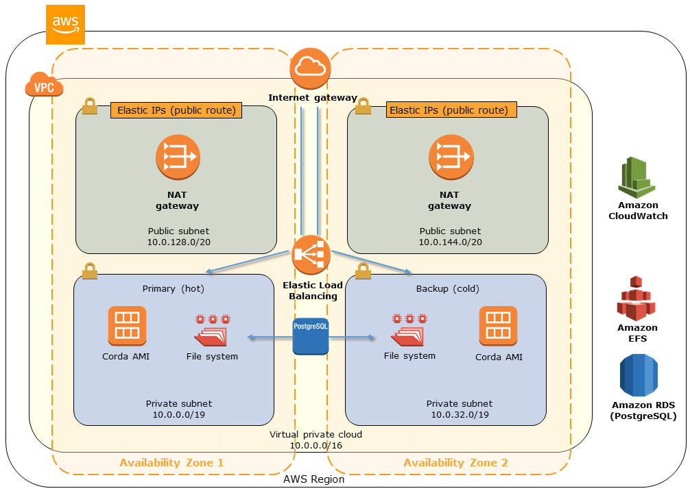

Deploying this Quick Start for a new virtual private cloud (VPC) with
default parameters builds the following {partner-product-short-name} environment in the
AWS Cloud.

// Replace this example diagram with your own. Send us your source PowerPoint file. Be sure to follow our guidelines here : http://(we should include these points on our contributors giude)
:xrefstyle: short
[#architecture1]
.Quick Start architecture for {partner-product-short-name} on AWS

As shown in <<architecture1>>, the Quick Start sets up the following:

* A virtual private cloud (VPC) configured across two Availability Zones with public and private subnets according to AWS best practices.*
* An internet gateway to allow access to the internet.*
* Managed NAT gateways to allow outbound internet access for the Corda node instances.*
* A logical Corda node with hot-cold instances across the two Availability Zones.
* Security groups for each instance, which restrict access to only the necessary protocols and ports.
* Elastic Load Balancing (ELB) load balancers to load-balance remote procedure calls (RPCs), and P2P traffic over TCP to the highly available Corda node instances.
* An Amazon Relational Database Service (Amazon RDS) PostgreSQL managed database instance configured for the Corda Vault and pertinent node state, such as check-pointing and keeping track of identities.
* An Amazon Elastic File System (Amazon EFS) instance shared by the instances across Availability Zones.
* Amazon CloudWatch logging of resources and Corda node.

[.small]#*The template that deploys the Quick Start into an existing VPC skips the components marked by asterisks and prompts you for your existing VPC configuration.#
